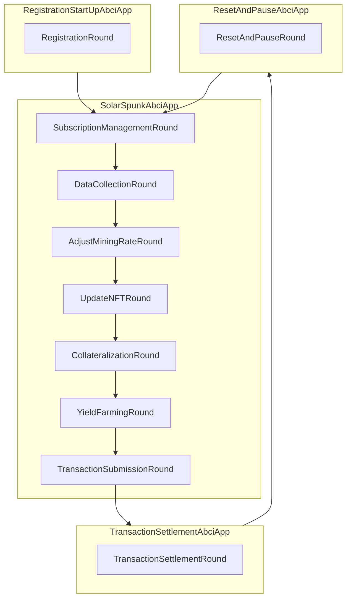

<h1 align="center">
    <b>SolarSpunk</b>
</h1>

<p align="center">
    <!-- Add badges here -->
</p>

1. ***Solar***: This part of the name directly references solar energy, highlighting the project's focus on renewable energy sources and sustainability.*
2. ***Spunk***: In the context of punk culture, "spunk" typically refers to boldness, energy, and a rebellious attitude. It conveys a sense of vigor, determination, and nonconformity.*


<!-- ## Introduction -->


## Problem Statement
- Traditional energy grids suffer from inefficiencies in energy distribution, leading to wastage and increased costs for consumers.
- Consumers have limited control over the source of energy they receive from their power providers.
- Energy suppliers are imposing additional charges for customers who generate excess energy through solar panels and wish to sell it back to the grid. These charges, known as "terugleverkosten" or back-feeding costs, are becoming increasingly common among energy providers [[1](https://balkangreenenergynews.com/dutch-prosumers-must-pay-fees-to-feed-surplus-electricity-to-grid/), [2](https://www.consumentenbond.nl/zonnepanelen/terugleverkosten)].


## How SolarSpunk addresses these issues:
- A community-owned service that facilitates automated peer-to-peer trading of energy.
- Additional energy production will never come at a cost and will instead be used to power a communal mining pool.
- Enable users to join local energy communities and collaborate on energy-saving initiatives and the adoption of renewable energy.
- Grants communities autonomy in managing their energy resources.





## Requirements

- Git
- [Poetry](https://github.com/python-poetry/poetry)
- [Docker](https://github.com/docker)
- Protocol buffers v24.3
    ```shell
    wget https://github.com/protocolbuffers/protobuf/releases/download/v24.3/protoc-24.3-linux-x86_64.zip && unzip protoc-24.3-linux-x86_64.zip -d protoc && sudo mv protoc/bin/protoc /usr/local/bin/protoc
    ```
- [Tendermint](https://docs.tendermint.com/v0.34/introduction/install.html) `==0.34.19`


## Install from source

Clone the repository:

```shell
git clone https://github.com/swissDAO-labs/SolarSpunk.git
```

Setup the environment
```shell
cd SolarPunk && make
```


## 1. Run Tendermint

Either containerized

```shell
docker pull tendermint/tendermint:v0.34.19
```

or, alternatively, run the node locally

```shell
wget https://github.com/tendermint/tendermint/releases/download/v0.34.19/tendermint_0.34.19_linux_amd64.tar.gz
tar -xf tendermint_0.34.19_linux_amd64.tar.gz
sudo mv tendermint /usr/local/bin/tendermint
```

```shell
GROUP=$(id -gn)
sudo chown -R $(whoami):$GROUP /home/$(whoami)/tendermint_data
```

Run the Tendermint node:
```shell
./scripts/run_tendermint.sh
```


## 2. Run the agent

```shell
scripts/run_agent.sh
```


## Contributing
Learn how to contribute to the project by following the guidelines in [CONTRIBUTING.md](CONTRIBUTING.md).

## Changelog
Explore the project's version history and changes in [CHANGELOG.md](CHANGELOG.md).

## License
This project is licensed under the [Apache2.0 license](LICENSE).
